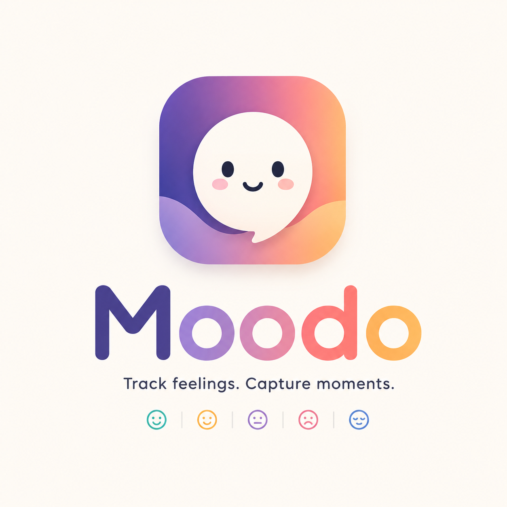
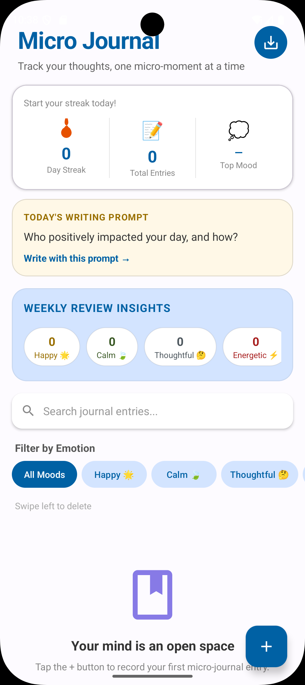
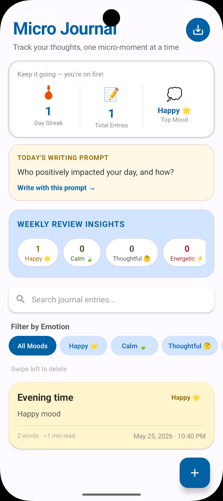
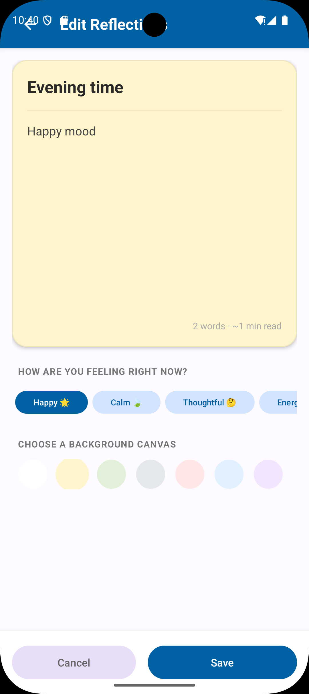

# Moodo ✨ 

> Track your thoughts, one micro-moment at a time.

A beautiful privacy-first Android micro-journaling app built with Java + Material Design 3.  
Capture daily reflections, track moods, build writing streaks, and rediscover memories — all stored securely on your device.

---


---

# 🌿 Moodo App (Bonus Project)

> A minimal mood tracking + emotional wellness app

Moodo is a lightweight emotional well-being Android app designed to help users track their daily moods, understand emotional patterns, and build mental clarity through simple logging.

---



---

# 📸 Screenshots

| Home Screen | Journal Editor | Mood Insights |
|-------------|----------------|----------------|
|  |  |  |


---

# 🎥 Demo


> Record a short screen demo and export it as GIF for a premium GitHub look.

---

# ✨ Features

- 📝 Quick journaling with title & reflection writing
- 🎨 Beautiful pastel canvas backgrounds
- 😊 Mood tracking with emotion tags
- 🔥 Daily writing streak system
- 📊 Weekly mood insights dashboard
- 💡 Daily writing prompts
- 📅 “On This Day” memory resurfacing
- 📌 Pin favorite reflections
- 🔍 Powerful search & mood filtering
- ↩️ Swipe to delete with undo support
- 📤 Share reflections instantly
- 💾 JSON export backup support
- 🌙 Dark mode support
- 🚀 Smooth onboarding experience
- 🔒 Privacy-first offline journaling

---

# 💡 Why Moodo?

Moodo was built to make journaling:
- simple
- calming
- distraction-free
- emotionally reflective

Instead of writing long diary pages, users can quickly capture small emotional moments throughout the day and build self-awareness over time.

No ads. No tracking. No distractions.

---

# 🧠 App Philosophy

Moodo encourages:
- mindful reflection
- emotional awareness
- consistency through micro-writing
- private self-expression

The app is intentionally lightweight, peaceful, and fully offline.

Your thoughts stay yours.

---

# 🏗️ Architecture

- Offline-first architecture
- SQLite local persistence
- Java + XML Android development
- Material Design 3 components
- MVVM-inspired structure
- RecyclerView-based journal feed
- Modular utility/helper classes

---

# 🛠️ Tech Stack

## Android
- Java
- XML Layouts
- Android SDK

## UI/UX
- Material Design 3
- Pastel-inspired interface
- Dark mode support

## Storage
- SQLite local database
- JSON export system

---

# 📱 SDK Configuration

| Config | Version |
|--------|---------|
| Min SDK | 24 |
| Target SDK | 36 |

---

# 🚀 Installation

## Requirements

- Android Studio
- Android SDK
- JDK 17

---

## Clone Repository

```bash
git clone https://github.com/kumarrajjava/Moodo.git
